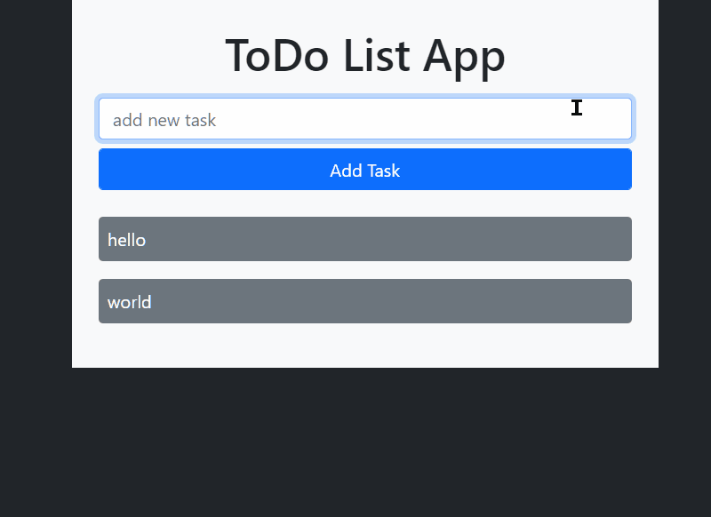
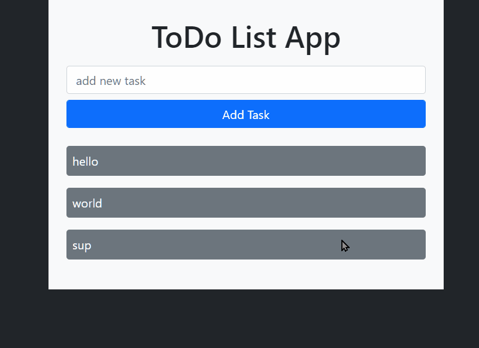

# todo-node-express
Simple todo list with GET, POST, and DELETE functions.

## Goals
- Practice setting up server.
- Do something with the data the user sends to server.
- Getting server to send static files.

## NPM used
 - `body-parser`
 - `dotenv`
 - `express`
 - `path`
 - `nodemon`

## [Live Link Soon](https://www.google.com/)
